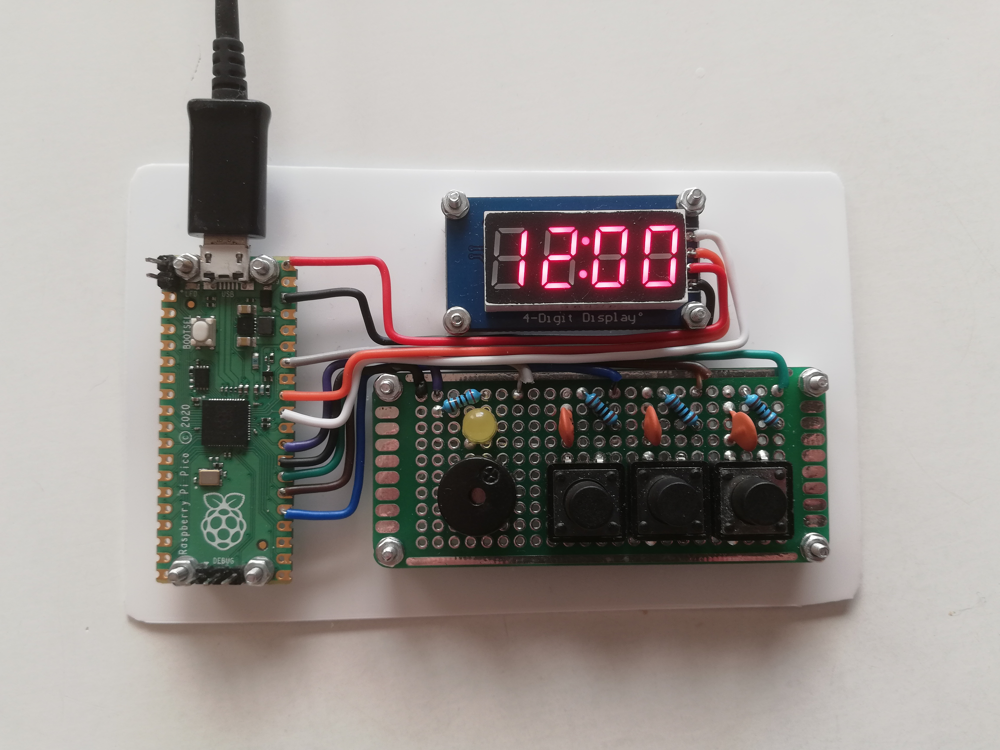

# Pico Alarm Clock

## Introduction
This is an alarm clock that is running on Raspberry Pi Pico and is displaying
on a TM1637 7-segment display. In this project I try to stay close to the
hardware and implement what I can from scratch. For example, I wrote my own
library for the display and I use real hardware interrupts for button clicks and
time based events.

## Dependencies
* [Raspberry Pi Pico SDK](https://github.com/raspberrypi/pico-sdk): The
  standard library for working with Pico.
* [Pico Extras](https://github.com/raspberrypi/pico-extras): Some additional
  libraries. I needed this for putting the Pico in sleep mode.
* [TM1637-pico](https://github.com/wahlencraft/TM1637-pico): My own library for
  writing to the 7-segment display.

## Setup
### Hardware

* Raspberry Pi Pico
* TM1637 7-segment display
* Passive buzzer
* 3 Buttons
* Led (I used a yellow one)
* 4 Resistors: 3 for button debouncing (1k) and 1 for the LED (2k). Exact
  sizes are not important and might vary depending on the buttons and LED.
* 3 Ceramic capacitors (100 nF) for button debouncing.
* A micro USB power cable and 5V power supply.

### Circuit

### Load Code
If loading code over UART (from for example a Raspberry Pi) some unexpected
behavior arises.

The openocd reset command does not work with this code. I don't know why but a
workaround is to remove that from the command. Load code with:
`openocd -f interface/raspberrypi-swd.cfg -f target/rp2040.cfg -c "program src/alarm-clock.elf verify exit"`
Then restart the Pico manually by using a reset switch or un- and re-plugging the
power.

## Usage
Under normal circumstances will the display show current time and wait for
alarms to fire. When the clock is turned on the time will be `Monday 00:00:00`
and there is no set alarms. To change the time or add an alarm, open the menu.
### The Settings Menu
If any button is pressed the menu will open. In the menu you can change the
display brightness, set clock time and set alarms. See the flowchart below for
a quick overview or read the following sections for an in-depth description.

#### Brightness
In the brightness state the display will show `br: x`, where `x` will change with
the brightness level. In- or decrease the brightness with the M and R buttons.
The brightness has 8 levels, ranging from 0 to 7. Although there seems to be
a very little change in brightness in the higher levels.
#### Set Clock
To enter Set Clock press the R button when the display shows `SEt`. Here you
can change the running clock.
- **Day of the week** (`da:xx`): In or decrease with the M and R buttons.
  A list of the days and their two letters:
  - Monday: `mo`
  - Tuesday: `tU`
  - Wednesday: `wE`
  - Thursday: `tH`
  - Friday: `Fr`
  - Saturday: `SA`
  - Sunday: `SU`
- **Hour** (`Hr:xx`): In- or decrease with the M and R buttons.
- **Minute** (`mi:xx`): In- or decrease with the M and R buttons.
- **Seconds** (`SE:xx`): Zero the counter with the M or R button. Please note
  that this only sets the current second to 0, it doesn't restart the RTC. This
  makes it impossible to set exactly when a second starts.
- **Done** (`done`): Go back to the main menu.
#### Alarms
To enter Alarms press the R button when the display shows `ALAr`. Then you will
be navigated to the first alarm, called `AL: 0`. Given that this alarm exists.
Otherwise you will see `nEw` on the display.

To create a new alarm, navigate to `nEw` and press R. That will open the edit
state for a new alarm.

To edit an existing alarm, navigate to `AL: x` and press R.

Editing an alarm works a lot like setting the clock. With some differences:
- You can not specify seconds
- Song (`So`). This is what sound the alarm will make. Use the
  R button to increment song and M button to listen to it (not yet
  implemented).
- Activate (`Act`): Toggle active status of this alarm. The LED will be on if
  the alarm is on and off if the alarm is off. When creating a new alarm is it
  by default on.
- Delete (`dEL`): Exit and delete the current alarm. Confirm deletion with R,
  abort with L or M.

Note that when exiting from `done`, you will always get to the first alarm
`AL: 0`. This is because the list of alarms will always be in chronological
order, and might need rearranging after an edit.

To delete an alarm, navigate to it and press M. Then press R. To abort press
any other button.
### The Alarms
You can have an unlimited numbers of alarms. Every alarm has a time (specified
by day of the week, hour and minute), a song (what tones will play when it
fires) and an active status. To change these see [this section](#alarms).

When an alarm fires it will play it's song and blink the LED. It will continue
until any button is pressed to stop it or the max duration has passed (default
5 minutes).

## Making modifications
If you want to make some modifications to the program i would recommend
starting with these files.

* [pins.h](src/pins.h): Here you can change what physical pin will have what
  function. So if your prototype does not have the same connections as mine you
  need to make changes here.
* [timout_timer.h](src/timeout_timer.h): Here you will find `ALARM_TIMEOUT`
  which determines for how long an alarm should fire before turning off
  automatically.
* [alarm.c:init_alarms()](src/alarm.c): Here the songs (alarm sounds) are
  defined. You can edit, add and remove songs. Please note that what tones that
  resonates best depends on your buzzer, so this might be necessary if you have
  a very different one from mine.
